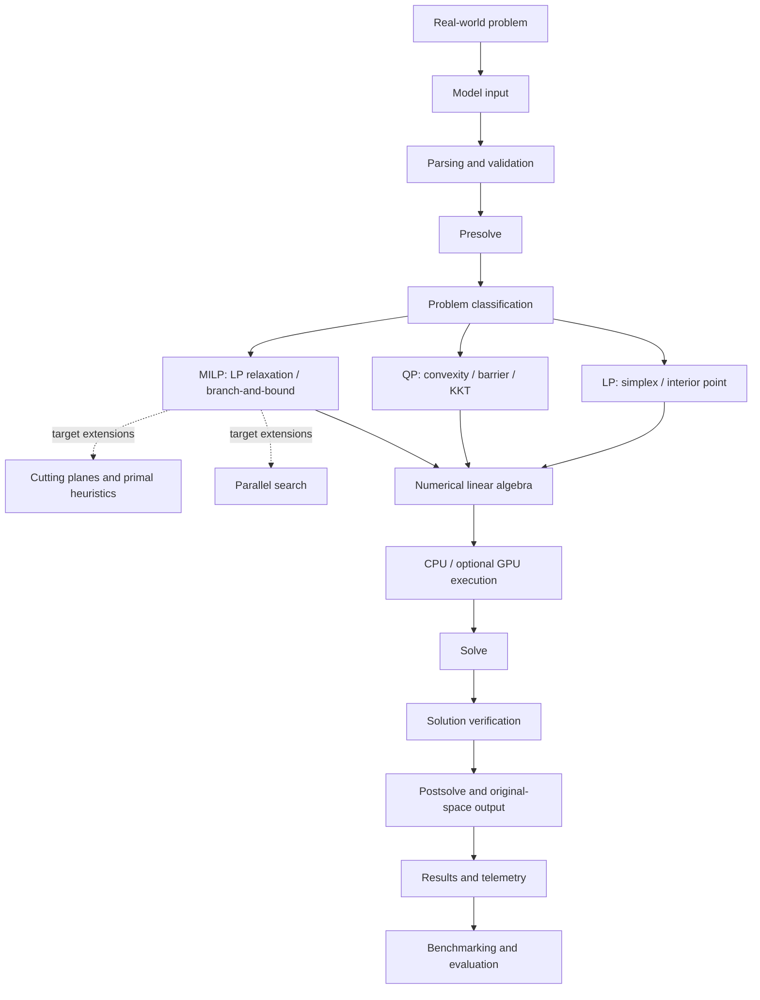
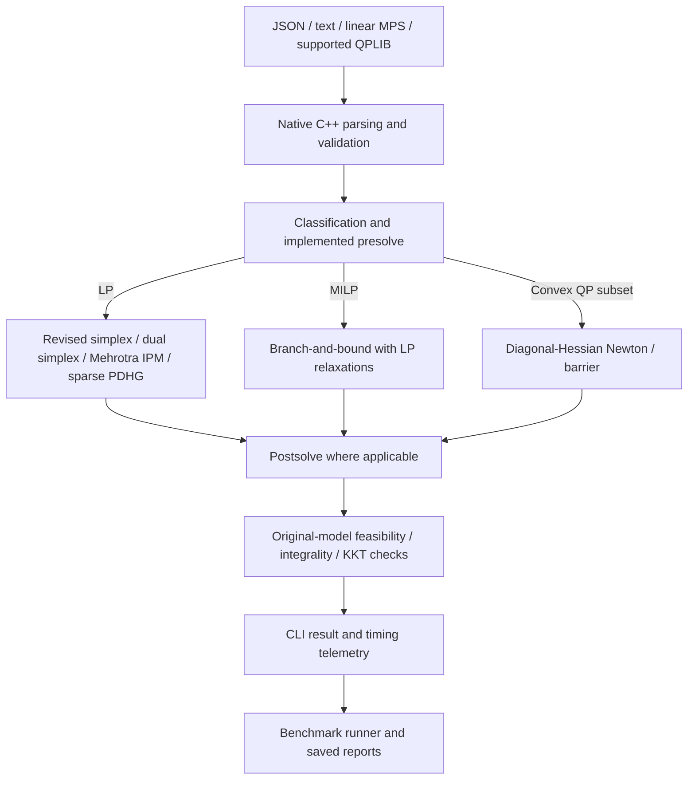

# Sovereign Optimization Solver

### A native C++17 prototype for LP, MILP, and convex QP

Sovereign is an optimization engine that owns its model parsing, presolve, solve, postsolve, and verification pipeline. It includes a native command-line solver, an optional CUDA numerical backend, reproducible benchmark tooling, and a web demonstration. It is an engineering prototype; it is not a production replacement for established solvers.

    

> **Prototype status:** LP, MILP, and a bounded diagonal-Hessian convex QP subset are implemented. Performance and model coverage are limited; see the benchmark evidence and limitations below.

## Contents

- [Overview](#overview)
- [Why Sovereign](#why-sovereign)
- [Target / Ideal Solver Architecture](#target--ideal-solver-architecture)
- [Current Implementation](#current-implementation)
- [LP](#linear-programming)
- [MILP](#mixed-integer-linear-programming)
- [QP](#quadratic-programming)
- [Presolve and verification](#presolve-and-verification)
- [CPU and CUDA](#cpu-and-cuda)
- [Verified benchmark snapshot](#verified-benchmark-snapshot)
- [Benchmark methodology](#benchmark-methodology)
- [Quick start](#quick-start)
- [Web demonstration](#web-demonstration)
- [Repository structure](#repository-structure)
- [Testing](#testing)
- [Current limitations](#current-prototype-limitations)
- [Roadmap](#roadmap)
- [Documentation](#documentation)

## Overview

Optimization applications often depend on mature external solver ecosystems. Sovereign explores implementing the core optimization pipeline within a native C++ project: read a model, validate and simplify it, solve it, reconstruct the original variables, and independently check the result. External solvers are optional benchmark references; they are not used by the Sovereign native solve path.

The project provides a C++17 CLI as its authoritative solver interface. Python supports model analysis and benchmark orchestration. An optional FastAPI dashboard provides interactive model selection, solve telemetry, and stored benchmark reports.

## Why Sovereign

The project is intended to make solver behavior inspectable: algorithm selection, CPU/CUDA backend, iteration or search telemetry, timing stages, and original-model verification are exposed in CLI or benchmark results. The benchmark runner records unsuccessful, unsupported, and timed-out cases so that the evidence remains reproducible.

## Target / Ideal Solver Architecture

> This diagram represents the intended end-state architecture. Some components are future work, not implemented features. The current supported subset is shown separately below.



The target diagram includes method families and future extensions as an architectural direction. It does not imply that every listed algorithm or execution route is complete.

## Current Implementation



| Capability | Current status |
|---|---|
| Native C++17 CLI | Implemented |
| LP | Revised simplex, dual simplex, Mehrotra interior point, and sparse PDHG paths |
| MILP | Serial branch-and-bound using LP relaxations; best-bound node selection and pseudocost-based branching |
| Convex QP | Experimental Newton/barrier path for supported bounded variables and diagonal Hessians |
| Presolve / postsolve | Implemented reductions and reconstruction for supported transformations |
| Original-model checks | LP/MILP primal feasibility and integrality; QP KKT checks on the supported route |
| CPU | Supported default execution backend |
| CUDA | Optional acceleration for selected numerical operations and sparse LP/PDHG workloads |
| Web demonstration | Optional FastAPI adapter and browser interface over the native CLI |
| Benchmarking | Dataset runner, reference comparisons where available, JSON/CSV records, and verification |

## Linear Programming

The native LP code includes revised simplex, dual simplex, Mehrotra predictor-corrector interior point, and a sparse PDHG path for continuous LPs. Automatic routing currently uses sparsity to choose between PDHG and revised simplex; PDHG can use CUDA when that build and device are available. Unsupported or failed automatic PDHG attempts can fall back to revised simplex. The selectable method and backend are reported by the solver.

These implementations are prototypes. A method being present does not mean it is competitive across all LP sizes or model structures.

## Mixed-Integer Linear Programming

MILP uses a serial branch-and-bound search with LP relaxations, best-bound node selection, and pseudocost-informed branching. Integer-safe presolve and postsolve support the current implementation. Results include incumbent/bound/gap and search telemetry where available, and a candidate is checked against the original model.

Cut generation and Feasibility Pump exist as separate experimental paths. They are not integrated as a complete branch-and-cut engine. There is no parallel branch-and-bound implementation.

## Quadratic Programming

The supported QP route checks convexity and uses a Newton/barrier method. Current QP transformation supports convex minimization with diagonal Hessians and variables having finite bounds; general off-diagonal sparse Hessians and free variables are not supported. Original-model KKT verification is reported for the demonstrated QP route. The QP route measured below ran on CPU.

## Presolve and verification

Presolve applies implemented reductions such as bound tightening, fixed-variable handling, substitutions where supported, redundant-row checks, and singleton-row processing. The exact reductions depend on the model and integer-semantics mode; this is not the full target presolve list above.

The solve pipeline restores supported reductions and evaluates the returned result against the original model. LP/MILP checks include primal feasibility and, for MILP, integrality. The demonstrated QP check includes primal, stationarity/dual, and complementarity residuals. A solver status by itself is not treated as proof that verification passed.

## CPU and CUDA

Sovereign is hybrid. Parsing, presolve, solver control, branch-and-bound, postsolve, and verification are CPU-managed. Optional CUDA code provides selected vector/matrix operations and sparse operations through cuBLAS, cuSPARSE, and cuSOLVER where the algorithm has a supported device path. It does **not** run the entire solver on the GPU: simplex, MILP branch-and-bound, and the measured QP solve are CPU paths. Small problems may remain on CPU to avoid device setup and transfer overhead.

Build CUDA support only when the NVIDIA CUDA Toolkit and a compatible compiler are installed; see [the CUDA build script](scripts/build_cuda.bat) and the `SOVEREIGN_ENABLE_CUDA` option in [the CMake configuration](cpp_solver/CMakeLists.txt). The default CPU build has no CUDA requirement.

## Verified benchmark snapshot

The table below is copied from the checked-in [final benchmark JSON](benchmarks/results/FINAL_SOLVER_BENCHMARK_20261003.json) and its [methodology report](benchmarks/FINAL_SOLVER_BENCHMARK_REPORT.md). Timings are medians from repeated Release CLI runs on the recorded Windows/MSVC machine. Solver time is the solver's internal timing; CLI wall time also includes process startup and output capture. These are representative instances, not broad scaling guarantees.

| Class / instance | Result | Objective | Verification | Median solver time | Median CLI wall |
|---|---|---:|---|---:|---:|
| LP · Netlib AFIRO | OPTIMAL · 16 iterations | -464.75314285714285 | PASS | 0.13135 ms | 16.6138 ms |
| MILP · FLUGPL | OPTIMAL · 5,367 nodes | 1,201,500 | PASS | 269.2061 ms | 286.485 ms |
| QP · QPLIB_9002 | OPTIMAL · 43 Newton iterations | 5,698,097,498.146622 | KKT PASS | 377.4874 ms | 455.0647 ms |

The final report records AFIRO and FLUGPL objective agreement with the available HiGHS and Gurobi references. FLUGPL required far more search nodes than either reference (5,367 for Sovereign, 89 for HiGHS, and Gurobi solved it in presolve); the prototype is not shown to be competitive on MILP. No completed reference QP result was available, so no QP comparison is claimed. Gurobi's restricted license limited the QP model size, the HiGHS QP trial returned no solution, and CPLEX was not installed.

The companion [LP/MILP optimization report](benchmarks/LP_MILP_FINAL_OPTIMIZATION_REPORT.md) records timed-out larger MILP cases and further controlled measurements. Those outcomes are retained as limitations rather than omitted. Do not compare timings with different timing scopes as a speed ranking.

## Benchmark methodology

- Final representative measurements use a Release MSVC build and repeated runs (10 LP runs; 5 MILP and QP runs).
- Solver-only time and fresh native-process wall time are distinct and reported separately.
- Solutions are independently evaluated against original-model constraints, bounds, integrality, and objective; QP includes KKT residual checks.
- Reference comparisons use the same model where available, but solver clocks and API/wall scopes differ. The reports explicitly avoid cross-scope speed claims.
- Dataset files are organized under `datasets/{lp,milp,qp}/{small,medium,large}`. The checked-in examples include Netlib-derived LP cases, FLUGPL/TIMTAB1 MILP fixtures, and QPLIB instances. Dataset provenance and unsupported cases are described in the benchmark reports; no datasets are downloaded automatically.

See [benchmark documentation](benchmarks/README.md), [final report](benchmarks/FINAL_SOLVER_BENCHMARK_REPORT.md), [machine-readable final results](benchmarks/results/FINAL_SOLVER_BENCHMARK_20261003.json), and [LP/MILP optimization report](benchmarks/LP_MILP_FINAL_OPTIMIZATION_REPORT.md).

## Quick start

### Prerequisites

- C++17 compiler
- CMake 3.16 or newer
- Python 3 for the test suite and optional web dashboard
- NVIDIA CUDA Toolkit only for an optional CUDA build

### Build the native Release CLI

From the repository root:

```powershell
cmake -S cpp_solver -B cpp_solver/build -DCMAKE_BUILD_TYPE=Release
cmake --build cpp_solver/build --config Release
```

The executable is typically `cpp_solver/build/sovereign_presolve_cli.exe` on a single-configuration Windows generator, or under `Release/` for a multi-configuration generator. This repository's benchmark build used `cpp_solver/build-route-cpu/sovereign_presolve_cli.exe`.

### Solve representative models

```powershell
# LP — AFIRO
cpp_solver\build-route-cpu\sovereign_presolve_cli.exe --input datasets\lp\small\afiro.mps --method revised-simplex --backend cpu

# MILP — FLUGPL
cpp_solver\build-route-cpu\sovereign_presolve_cli.exe --input datasets\milp\small\flugpl.mps --method milp --backend cpu

# Convex diagonal-Q QP — QPLIB_9002
cpp_solver\build-route-cpu\sovereign_presolve_cli.exe --input datasets\qp\small\QPLIB_9002.qplib --method qp --backend cpu
```

Use the executable path produced by your selected CMake generator. Run the CLI without required arguments to print its usage. The QPLIB command demonstrates only the supported diagonal-Hessian QP subset.

## Web demonstration

The web interface is an optional presentation and interaction layer around the native C++ CLI; it is not the solver implementation. The CLI remains usable without Python, FastAPI, or a browser.

On Windows, install the web dependencies and launch the demo from the repository root:

```powershell
python -m venv .venv-web
.\.venv-web\Scripts\python.exe -m pip install -r webui\requirements.txt
.\scripts\start_live_demo.ps1
```

Then open <http://127.0.0.1:8000/>. The script expects a built CLI at the path documented in [the live demo guide](docs/LIVE_DEMO.md); set `SOVEREIGN_SOLVER_EXECUTABLE` to use a different build. The dashboard can show stored benchmark reports without rerunning benchmark jobs.

## Repository structure

```text
cpp_solver/       Native C++ engine, headers, CLI, and C++ tests
datasets/         LP, MILP, and QP model inputs grouped by size
examples/         Small project-format and MPS examples
benchmarks/       Benchmark methodology, reports, results, and runner inputs
sovereign_solver/ Python parsing, analysis, and benchmark tooling
tests/            Python regression and adapter tests
webui/            Optional FastAPI backend and browser application
scripts/          Build, data, benchmark, and demo scripts
docs/             Live demo setup and rehearsal notes
README.md         Project overview and verified quick start
```

## Testing

Run the C++ test suite from a configured build directory and Python tests from the repository root:

```powershell
ctest --test-dir cpp_solver/build --output-on-failure
python -m unittest discover -s tests -p "test_*.py" -v
```

The checked-in final benchmark record reports 10/10 C++ CTest targets and 59/59 Python tests at that report's source revision. This final presentation pass reruns the current Python suite; test counts can change as tests are added. Build and test artifacts are not benchmark results.

## Current prototype limitations

- The QP solver supports diagonal Hessians only and does not support free variables or general sparse off-diagonal quadratic terms.
- Medium and large QP coverage is not validated; QPLIB_8906 is rejected due to off-diagonal Hessian entries.
- MILP scaling is limited. FLUGPL needed 5,367 nodes; larger recorded instances timed out without an incumbent.
- Presolve, cutting planes, and heuristics do not constitute a complete production branch-and-cut system.
- CUDA accelerates selected numerical paths only. The documented MILP and QP measurements ran on CPU.
- The benchmark evidence is a small set of representative instances, not a comprehensive performance comparison.
- No project license file is present. Confirm licensing before redistribution.

## Roadmap

- General sparse off-diagonal QP Hessians and broader QP model support
- Stronger MILP cuts and primal heuristics integrated into branch-and-bound
- Fewer branch-and-bound nodes, stronger relaxations, and broader MILP validation
- Wider GPU-resident numerical paths and measured CPU/GPU comparisons
- More independent benchmark coverage and numerical robustness work
- Parallel branch-and-bound exploration

These are future directions, not current capabilities.

## Documentation

- [Benchmark runner and dataset notes](benchmarks/README.md)
- [Final verified benchmark report](benchmarks/FINAL_SOLVER_BENCHMARK_REPORT.md)
- [LP/MILP optimization report and timeout evidence](benchmarks/LP_MILP_FINAL_OPTIMIZATION_REPORT.md)
- [AFIRO LP baseline](benchmarks/LP_SMALL_FULL_BENCHMARK_20261003.md)
- [QPLIB_9002 QP baseline and fix](benchmarks/QP_SMALL_BASELINE_AND_FIX_20261003.md)
- [Live demo setup and rehearsal](docs/LIVE_DEMO.md)
- [Native solver source](cpp_solver/)
